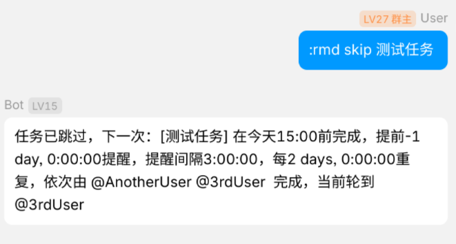

# nonebot-plugin-yareminder

又一个提醒插件、支持完成打卡及按任务配置提醒间隔/时间和重复间隔/类型、

<a href="./LICENSE">
    
</a>
<a href="https://pypi.python.org/pypi/nonebot-plugin-yareminder">
    
</a>


</div>


## 介绍

通过对话按群聊/私聊管理定时提醒任务的Nonebot2插件。相比常见的待办/日历应用，和IM结合大概能起到全自动压力/催人的作用，在活跃群聊中使用有奇效。

- 指派任务并循环At提醒
- 需要手动打卡完成任务
- 根据完成时间/固定间隔重复提醒
- 基于 [nonebot-plugin-saa](https://github.com/MountainDash/nonebot-plugin-send-anything-anywhere) 的跨适配器支持
- 基于 [nonebot-plugin-orm](https://github.com/nonebot/plugin-orm) 的持久化

## 计划

- refactor/更好的检索任务函数
- refactor/加测试
- feat/统计拖延时间
- fix/时间的自然语言输出在1-3周内差一周
- feat/更激进或烦人的提醒：跨群聊乃至平台寻找任务指派人并提醒
- feat/请假及暂停功能：对特定任务/时间段请假（自动跳过）或在特定时间段内暂停任务
- feat/静音提醒：收到提醒消息后手动确认可一段时间内暂停提醒
- feat/用户系统：单用户多平台/多账号支持、昵称
- feat/可填入格式化模板的提醒内容

## 安装

<details open>
<summary>使用 nb-cli 安装</summary>
在 nonebot2 项目的根目录下打开命令行, 输入以下指令即可安装

    nb plugin install nonebot-plugin-yareminder

</details>

<details>
<summary>使用包管理器安装</summary>
在 nonebot2 项目的插件目录下, 打开命令行, 根据你使用的包管理器, 输入相应的安装命令

<details>
<summary>pip</summary>

    pip install nonebot-plugin-yareminder
</details>
<details>
<summary>pdm</summary>

    pdm add nonebot-plugin-yareminder
</details>
<details>
<summary>poetry</summary>

    poetry add nonebot-plugin-yareminder
</details>
<details>
<summary>conda</summary>

    conda install nonebot-plugin-yareminder
</details>

打开 nonebot2 项目根目录下的 `pyproject.toml` 文件, 在 `[tool.nonebot]` 部分追加写入

    plugins = ["nonebot_plugin_yareminder"]

</details>

## 使用
### 指令表

```commandline
:rmd
Usage: :rmd COMMAND [OPTIONS] [ARGS] ...

Commands:
  add       Create a task
  rm        Delete a task
  ls        List all tasks in current chat
  finish    Finish a task (and triggers reoccurence if set)
  skip      Skip a task('s assignee) to the next or specified offset
  due       Show / Change the due time of a task
  remind    Show / Change the remind interval / starting time of a task
  recur     Show / Change the recurrence type / interval of a task
  assign    Show / Change the assignee(s) of a task
```

<details>
<summary>添加任务</summary>

```commandline
:rmd add
Usage: :rmd add TASK_NAME DUE_TIME [OPTIONS]

Options:
-i | --remind-interval <datetime_str>       Specify remind interval
-o | --remind-offset XdXhXmXs               Specify when to begin reminding relative to due time
-t | --recur-type OnFinish|Regular|Never    Specify recurrence type
-r | --recur-interval XdXhXmXs              Specify recurrence interval

```
</details>

<details>
<summary>删除任务</summary>

```commandline
:rmd rm
Usage: :rmd rm TASK_NAME
```

</details>

<details>
<summary>列出任务</summary>

```commandline
:rmd ls
Usage: :rmd ls
```

</details>

<details>
<summary>完成任务</summary>

```commandline
:rmd finish
Usage: :rmd finish [TASK_NAME]
```

</details>

<details>
<summary>跳过任务</summary>

```commandline
:rmd skip
Usage: rmd skip [TASK_NAME] [OPTIONS]

Options:
--offset n    Skip to the nth assignee after the current one
```

</details>

<details>

<summary>查看/修改任务到期时间</summary>

```commandline
:rmd due
Usage: rmd due TASK_NAME [OPTIONS]

Options:
--shift XdXhXmXs        shift the due time by a time range
--set <datetime_str>    set the due time directly
```

</details>

<details>
<summary>查看/修改任务提醒提前时间/周期</summary>

```commandline
:rmd remind
Usage: rmd remind TASK_NAME [OPTIONS]

Options:
-o|--offset +/-XdXhXmXs set how long to remind in advance of due time
-i|--interval XdXhXmXs  set remind interval
```


</details>

<details>
<summary>查看/修改任务重复类型/周期</summary>

```commandline
:rmd recur
Usage: rmd recur TASK_NAME [OPTIONS]

Options:
-t|--type OnFinish|Regular|Never    set recurrence type 
-i|--interval XdXhXmXs              set recurrence interval
```

</details>

<details>
<summary>查看/修改任务指派</summary>

```commandline
:rmd assign
Usage: rmd assign TASK_NAME [OPTIONS] [AT1] [AT2] ...

Options:
-r|--rm     instead of add, remove assignees in ats from specified task
```

</details>

## 使用示例




